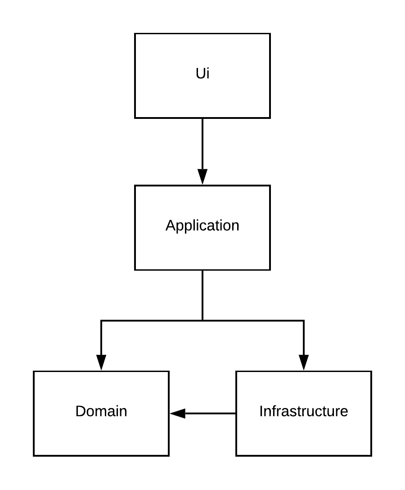
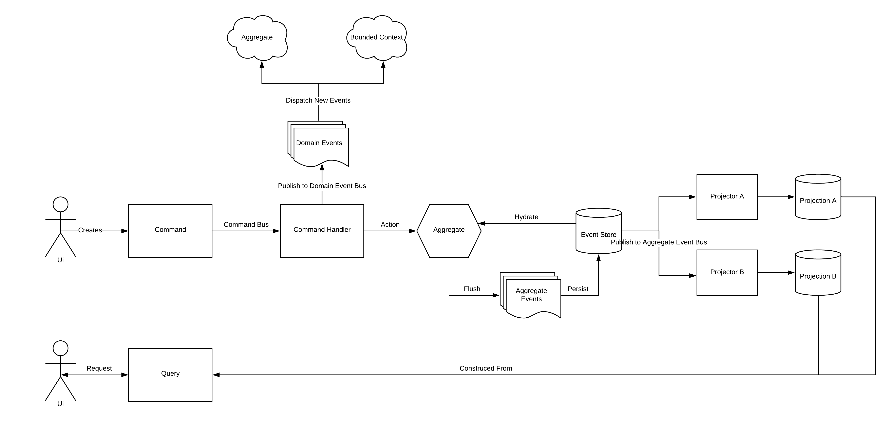
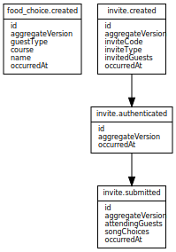
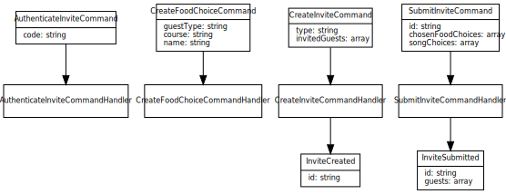

# Our Wedding Website

Because every Wedding RSVP website needs to follow DDD, CQRS, Hexagonal Architecture, Event Sourcing, and be deployed on Lambda.

## Overview

This application (and [associated infrastructure](https://github.com/eddmann/our-wedding-infra)) documents an approach to building complex systems which require the benefits that DDD, Hexagonal Architecture and Event Sourcing provide.
On-top of this it shows how such an application can be combined with Terraform and deployed in a Serverless manor.

Using PHP and the Symfony framework it highlights how such an approach can be laid out, coupled with a sufficient testing strategy and local development environment.
Some topics and features covered within this application are:

- Use of PHP 8.1 and [Bref](https://bref.sh/) for Serverless Lambda environment.
- Docker-based local [development environment](./docker) (inc. PostgreSQL), which replicates the intended Lambda platform.
- GNU make used to assist in running the application locally and performing CI-based tasks.
- CI pipeline developed using [GitHub workflows](./.github/workflows), running the provided tests and deploying the application to the given stage-environments (staging and production).
- Implements the desired Message buses using [Symfony Messenger](https://symfony.com/doc/current/messenger.html), with asynchronous transport being handled by SQS/Lambda.
- Runtime secrets pulled in via Secrets Manager (and cached using APCu) using a Symfony [environment variable processor](https://symfony.com/doc/current/configuration/env_var_processors.html).
- Email communication sent using [Symfony Mailer](https://symfony.com/doc/current/mailer.html) (via Gmail), with local testing achieved using MailHog.
- [Webpack Encore](https://symfony.com/doc/current/frontend.html) used to transpile and bundle assets (TypeScript, CSS and Images) used throughout the website.
- Event stream snapshots generated and validated within _Application_ level tests, providing regression testing for present stream structures.
- Automated aggregate event diagrams created using the _Application_ level Event stream snapshots, combined with Graphviz.
- Automated documentation/diagrams generated for the present Commands within the system.
- Use of [Deptrac](https://github.com/qossmic/deptrac) to ensure that desired Hexagonal Architecture layering is maintained.
- [Psalm](https://psalm.dev/) and [PHP Coding Standards Fixer](https://cs.symfony.com/) employed to ensure correctness and coding standards maintained.
- DynamoDB configured to manage client sessions within a deployed stage-environment.

## Getting Started

**Prerequisite:** ensure you have Docker installed on your local machine.

```
make start
make open-web
make can-release
```

All available actions within the local development environment are available (and documented) within the [Makefile](Makefile) by running `make help`.

## Architecture

The application follows CQRS for interaction between the _Ui_ and _Application_, Hexagonal Architecture to decouple the _Infrastructural_ concerns, and DDD/Event Sourcing to model the _Domain_.

### Layers

Following Hexagonal Architecture, the layers have been defined like so:



### Communication Flow

Based on the above layers, we employ three distinct message buses (_Command_, _Aggregate Event_ and _Domain Event_), modeling the Aggregates using Event Sourcing.
The following diagram highlights how these three buses interact during a typical Command/Query lifecycle response.



### Aggregate Events

There are two Aggregates within the Domain ([FoodChoice](app/src/Domain/Model/FoodChoice) and [Invite](app/src/Domain/Model/Invite)), the Aggregate Event flow for both goes as follows:



This diagram is automatically generated based on the current implementation, using [testable](app/tests/Application/Command/CommandTestCase.php) Event [snapshots](app/tests/Application/Command/EventStoreSnapshots) at the Command level.

#### Commands and Domain Events

Application-level Commands which are available for the _Ui_ to interact with the _Domain_ are presented below:



Along with the Command and Command Handlers, this also deptics the associated Domain Events which are emitted.

## Testing

The testing strategy employed within this application helps aid in following a [Test Pyramid](https://martinfowler.com/articles/practical-test-pyramid.html), favouring _testing behaviour over implementation_.
In doing this we exercise most of our behavioral assertions at the _Application_ layer, testing the public API provided by the Commands and Query services.
This provides us with a clear description of the intended application's behaviour, whilst reducing the brittleness of the given tests as only public contracts are used.

Testing has been broken up into a similar Hexagonal Architecture layered representation as the system itself, like so:

**Domain**

Low-level domain testing which is heavily coupled to the current implementation.
This is used in cases where you wish to have a higher-level of confidence of a given implementation which can not be easier asserted at the _Application_ level.

**Application**

Unit tests (ala [Unit of behaviour](https://vimeo.com/68375232)) which use the public API exposed by the Commands and Query services to assert correctness.
These are isolated from any infrastructural concerns (via test doubles) and exercise the core business logic/behaviour that the application provides.
This level provides us with the greatest balance between asserting that the current implementation achieves the desired behaviour, whilst not being over-coupled to the implementation causing the test to become brittle.
Depending only on the public API within these tests allows us to refactor the underlying _Domain_ implementation going forward whilst keeping the tests intact.
As such, it is desired to have the most amount of testing at this level.

**Infrastructure**

Contractual tests to assert that the given _adaptor_ implementation completes the required _ports_ responsibility; communicating with external infrastructure (such as a database) in isolation to achieve this.

**Ui**

Full-system tests which exercises the entire system by-way of common use-cases.
This provides us with confidence at the highest-level that the application is achieving the desired behaviour.

## Linting

The application uses the following linting tools to maintain the desired code quality and application correctness.

- [Psalm](https://psalm.dev/) - used to provide type-checking support within PHP (`app/psalm.xml`).
- [PHP Coding Standards Fixer](https://cs.symfony.com/) - ensures the desired PHP code styling is maintained (`app/.php-cs-fixer.php`).
- [Deptrac](https://github.com/qossmic/deptrac) - ensures we adhere to the strict Hexagonal Architectural layering boundaries we have imposed (`depfile.yml`).
- [Local PHP Security Checker](https://github.com/fabpot/local-php-security-checker) - ensures that no known vulnerable dependencies are used within the application.
- [Prettier](https://prettier.io/) - ensures the desired JS code style is maintained (`app/package.json`).

These tools can be run locally using `make lint`, returning a non-zero status code upon failure.
This process is also completed during a `make can-release` invocation.

## Infrastructure

The application is hosted on AWS Lambda with transient infrastructure (which change based on each deployment) being provisioned using the [Serverless Framework](./app/serverless.yml).
Resources managed at this level include Lambda functions, API-gateways and SQS event integrations.
Foundational infrastructural concerns (such as networking, databases, queues etc.) are provisioned using Terraform and can be found in the [related repository](https://github.com/eddmann/our-wedding-infra).

Sharing between Terraform and Serverless Framework is unidirectional, with the application resources that Serverless Framework creates being built upon the _foundation_ that Terraform resources provision.
Parameters, secrets and shared resources which are controlled by Terraform are accessible to this application via SSM parameters and Secrets Manager secrets; providing clear responsibility separation.
